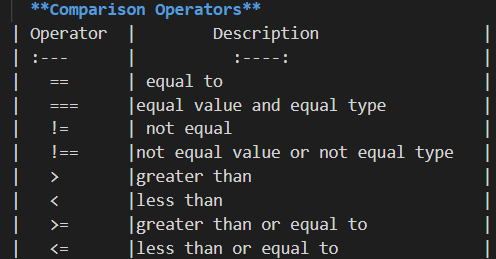
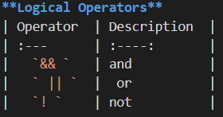
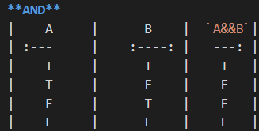
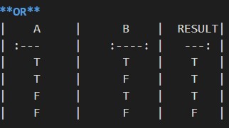
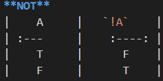

# Operators and Loops

**Conditional statements** control behavior in JavaScript and determine whether or not pieces of code can run(Conditional statements allow your code to make decisions about what to do next).

+ There are multiple different types of conditionals in JavaScript including:

  “If” statements: where if a condition is true it is used to specify execution for a block of code.

  “Else” statements: where if the same condition is false it specifies the execution for a block of code.

  “Else if” statements: this specifies a new test if the first condition is false.

## There are three types of loop: for, while, and  do ... while. Each repeats a set of statements.
1. **for** - loops through a block of code a number of times

    **The for loop has the following syntax:**

      For (statement 1; statement 2; statement 3) {

         // code block to be executed

            }

+ **Statement 1** is executed (one time) before the execution of the code block.

+ **Statement 2** defines the condition for executing the code block.

+ **Statement 3** is executed (every time) after the code block has been executed.
 
 
2. **while** - loops through a block of code while a specified condition is true
      
    **The while loop has the following syntax:**

     while (condition) {

    // code block to be executed
          }

3. **do/while** - also loops through a block of code while a specified condition is true(the loop will always be executed at least once, even if the condition is false, because the code block is executed before the condition is tested).

    **The do_while loop has the following syntax:**

      do {

    // code block to be executed
    
    }
    while (condition);