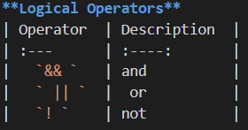
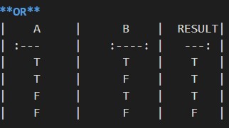

# HTML Text, CSS Introduction, and Basic JavaScript Instructions
# **HTML book**
## Chapter 2: Text

**Structural markup**(Tells nothing about its content): the elements that you can use to describe both headings and paragraphs

**Semantic markup**(Clearly defines its content): which provides extra information; such  as where emphasis is placed in a sentence, that something you have written is a quotation (and who said it), the meaning of acronyms, and so on

In **HTM**L there are some semantic elements that can be used to define different parts of a web page:
`<article> <aside> 
 <figcaption> <figure> <footer> <main> <mark> <nav> <header> `
`<section> 
 <time>`

### Headings

  HTML headings are defined with the `<h1>` to `<h6>` tags.

+ `<h1>` defines the most important heading.

+ `<h6>`defines the least important heading.

### Paragraphs

The HTML `
` element defines a paragraph.

+ A paragraph always starts on a new line, and browsers automatically add some white space (a margin) before and after a paragraph.

### Bold & Italic

+ HTML `<b>` and `<strong>` Elements:
  1. The HTML `<b>` element defines bold text, without any extra importance

  2. The HTML `<strong>` element defines text with strong importance. The content inside is typically displayed in bold.

+ HTML `<i>` and `<em>` Elements:
  1. The HTML `<i>` element defines a part of text in an alternate voice or mood. The content inside is typically displayed in italic.

  2. The HTML `<em>` element defines emphasized text. The content inside is typically displayed in italic.

### Superscript & Subscript
+ HTML `` Element:
    + The HTML `` element defines subscript text. Subscript text appears half a character below the normal line, and is sometimes rendered in a smaller font. Subscript text can be used for chemical formulas, like `H2O`

+ HTML ` `Element:
   + The HTML `` element defines superscript text. Superscript text appears half a character above the normal line, and is sometimes rendered in a smaller font. Superscript text can be used for footnotes, like `WWW[1]`

### Line Breaks & Horizontal Rules

+ HTML Line Breaks
  1. The HTML ` ` element defines a line break.

  2. Use `  `if you want a line break (a new line) without starting a new paragraph.

+ HTML Horizontal Rules
  1. The `
` tag defines a thematic break in an HTML page, and is most often displayed as a horizontal rule.

  2. The `
` element is used to separate content (or define a change) in an HTML page.

### Quotation
+ The `<blockquote> `element is used for longer quotes that take up an entire paragraph.

+ The `<q>` element is used for shorter quotes that sit within a paragraph.

### abbre Viations & acronyms :
+ `<abbr>` If you use an abbreviation or an acronym, then the`<abbr>`element can be used. A titleattribute on the opening tag is used to specify the full term.

### citations &definitions:
+ The `<cite>` tag defines the title of a creative work (e.g. a book, a poem, a song, a movie, a painting, a sculpture, etc.).

     ***Note: A person's name is not the title of a work.***

+ The `<dfn>` tag stands for the "definition element", and it specifies a term that is going to be defined within the content.

+ The nearest parent of the `<dfn>` tag must also contain the definition/explanation for the term.

### author details
+ The `<address>` element has quite a specific use: to contain contact details for the author of the page.

### changes To content
+ The `<ins>` element can be used to show content that has been inserted into a document, while the `<del>` element can show text that has been deleted from it.

+ The `<s>` element indicates something that is no longer accurate or relevant (but that should not be deleted).

## Chapter 10: Introducing CSS

What is CSS?

  **Cascading Style Sheets (CSS)** is used to format the layout of a webpage and to make your web pages more attractive(Controlling the design of the them using CSS).

  With CSS, you can control the color, font, the size of text, the spacing between elements, how elements are positioned and laid out, what background images or background colors are to be used, different displays for different devices and screen sizes, and much more!

## Using CSS
+ CSS can be added to HTML documents in 3 ways:

1. **Inline** - by using the style attribute inside HTML elements

2. **Internal** - by using a ``

   ### External CSS
   + An external style sheet is used to define the style for many HTML pages.

     `<link rel="stylesheet" href="styles.css">`

   ### CSS Colors, Fonts and Sizes

  + The CSS color property defines the text color to be used.

  + The CSS font-family property defines the font to be used.

  + The CSS font-size property defines the text size to be used.

     Use the HTML style attribute for inline styling

     Use the HTML `<style>` element to define internal CSS

     Use the HTML `<link>` element to refer to an external CSS file

     Use the HTML `<head>` element to store `<style>` and `<link>` elements

     Use the CSS color property for text colors

     Use the CSS font-family property for text fonts

     Use the CSS font-size property for text sizes

     Use the CSS border property for borders

     Use the CSS padding property for space inside the border

     Use the CSS margin property for space outside the border
      
      

       

      niversal selector `*{} `target all elements on the page

      Type selector` h1,h2,h3 {}` targets the `<h1>,<h2>,<h3>`

      Class selector `.note{}`

      Id selector` #introduction{}`

      Child selector `li>a{}`

      Descendant selector p `a {}`

# **JS book**
## Chapter 2: Basic JavaScript Instructions
A script is a series of instructions that the computer can follow in order to achieve a goal. 

**JavaScript** allows you to make web pages more interactive by modifying the contents, reflecting that modification on the web page, and responding to what the user is doing.

**variable:its somthing that stores values**
**using the `var` keyword the only way to declare a JavaScript variable.**
All JavaScript variables must be identified with unique names.These unique names are called ***identifiers***.

+ The general rules for constructing names for variables (unique identifiers) are:

  1. Names can contain letters, digits, underscores, and dollar signs.
  2. Names must begin with a letter
  3. Names are case sensitive (y and Y are different variables)
  4. Reserved words (like JavaScript keywords) cannot be used as names

| Data Types    |              Example                      | 
| :---          |             :----:                        |            
|    String     |     'hello', "hello world!"               | 
|    Number     |            3, 3.234                       | 
|    Boolean    |          true and false                   | 
|    Object     |         let student = { };                | 

#### Array
An array is a special type of variable. It doesn't just store one value; it stores a list of values.

this exapmle from the book :

`var colors;`
`colors ['white', 'black', ' custom'];`
`var el document.getElementByld('col ors');`
`el.textContent = col ors[O]; `

	
	
| Code  |      Result        | 
| :---  |      :----:        |
|  \b   |Backspace           | 
|  \f   |Form Feed           | 
|  \n   |New Line            | 
|  \r   |Carriage Return     | 
|  \t   |Horizontal Tabulator| 
|  \v   |Vertical Tabulator  | 

#### OPERATORS 

Expressions rely on things called operators; they allow programmers to create a single value from one or more values. 
  
  
 **Arithmatic Operators**
| Operator  | Description   | 
| :---      |   :----:      |
|   +       |Addition       | 
|   -       |Subtraction    | 
|   *       |Multiplication | 
|   **      |Exponentiation | 
|   /       |Division       | 
|   %       |ModulusVer     | 
|   x++     |x+1            | 
|   x--     |x-1            | 
|   x+=1    |x=x+1          | 
|   x-=1    |x=x-1          | 

**JavaScript Comments**

Single line comments start with //.

Multi-line comments start with /* and end with */.

## Chapter 4: Decisions and Loops

**Conditional statements** control behavior in JavaScript and determine whether or not pieces of code can run(Conditional statements allow your code to make decisions about what to do next).

+ There are multiple different types of conditionals in JavaScript including:

  “If” statements: where if a condition is true it is used to specify execution for a block of code.

  “Else” statements: where if the same condition is false it specifies the execution for a block of code.

  “Else if” statements: this specifies a new test if the first condition is false.

**Comparison Operators**
| Operator  |        Description                 | 
| :---      |          :----:                    |
|   ==      |	equal to                         | 
|   ===     |equal value and equal type          | 
|   !=      |	not equal                        | 
|   !==     |not equal value or not equal type	 | 
|   >       |greater than	                     | 
|   <       |less than	                         | 
|   >=      |greater than or equal to	         | 
|   <=      |less than or equal to               | 
	

### How to Write a Git Commit Message
If you browse the log of any random Git repository, you will probably find its commit messages are more or less a mess. a well-crafted Git commit message is the best way to communicate context about a change to fellow developers (and indeed to their future selves). A diff will tell you what changed, but only the commit message can properly tell you why.

The seven rules of a great Git commit message :
1. Separate subject from body with a blank line
2. Limit the subject line to 50 characters
3. Capitalize the subject line
4. Do not end the subject line with a period
5. Use the imperative mood in the subject line
6. Wrap the body at 72 characters
7. Use the body to explain what and why vs. how.
