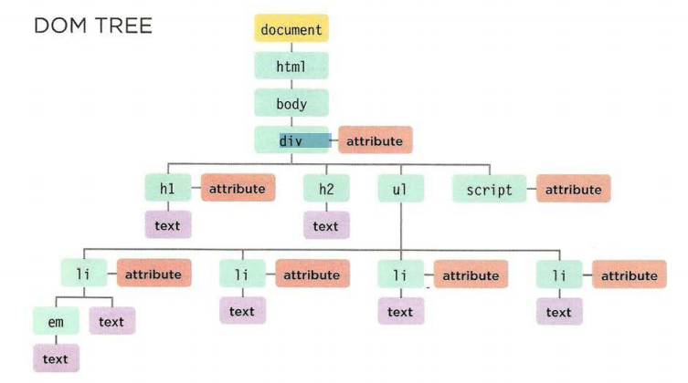

#  **Understanding The Problem Domain Is The Hardest Part Of Programming**

## What is the hardest thing about writing code?
1. Learning a new technology

2. Naming things

3. Testing your code

4. Debugging

5. Fixing bugs

6. Making software maintainable The list goes on and on.

 Many of the problem domains we face as programmers are difficult to understand and look completely different depending on your viewpoint. we also are often not given complete information about the problem domain, so we don’t even have the information we need to understand it.

## What can you do about it?

+ if understanding the problem domain is the hardest part of programming and you want to make programming easier, you can do one of two things:

 1. Make the problem domain easier(You can often make the problem domain easier by cutting out cases and narrowing your focus to a particular part of the problem).

2. Get better at understanding the problem domain

#  **JS BOOK**

## Chapter 3: “Object Literals” 

### WHAT IS AN OBJECT? 

`var person = new Object();`

Objects group together a set of variables and functions to create a model of a something you would recognize from the real world. In an object, variables and functions take on new names. 

+ IN AN OBJECT: **VARIABLES** BECOME KNOWN AS **PROPERTIES**

`firstName = "John";`

`lastName = "Doe";`

`age = 50;`

`eyeColor = "blue"; `

+ IN AN OBJECT: **FUNCTIONS** BECOME KNOWN AS  **METHODS**

`var person = {`

  `firstName: "John",`

  `lastName : "Doe",`

  `id       : 5566,`

  `fullName : function() {`
    `return this.firstName + " " + this.lastName;`
  `}`
`};`

**In JavaScript, almost "everything" is an object.**
 + Booleans can be *objects* (if defined with the new keyword)
 + Numbers can be *objects* (if defined with the new keyword)
 + Strings can be *objects* (if defined with the new keyword)
 + Dates are always *objects*
 + Maths are always *objects*
 + Arrays are always *objects*
 + Functions are always *objects*
 + Objects are always *objects*
 
 

## Chapter 5: “Document Object Model” 

+ **The Document Object Model (DOM)** specifies how browsers should create a model of an HTML page and how JavaScript can access and update the contents of a web page while it is in the browser window.

  + ACCESSING AND CHANGING THE HTML PAGE :The DOM also defines methods and properties to access and update each object in this model, which in    turn updates what the user sees in the browser. 

  + THE DOM TREE IS A MODEL OF A WEB PAGE:As a browser loads a web page, it creates a model of that page.The model is called a DOM tree, and it is stored in the browser's memory .It consists of four main types of nodes.

+ **WORKING WITH THE DOM TREE**

Accessing and updating the DOM tree involves two steps: 
1. Locate the node that represents the element you want to work with. 
2. Use its text content, child elements, and attributes.

+ **ACCESSING ELEMENTS**

 DOM queries may return one element, or they may return a Nodelist, which is a collection of nodes. 

 + The browser represents the page using a DOM tree. 

 + DOM trees have four types of nodes: document nodes, element nodes, attribute nodes, and text nodes. 

 + You can select element nodes by their id or class attributes, by tag name, or using CSS selector syntax. Whenever a DOM query can return more than one node, it will always return a Nadelist. 

 + From an element node, you can access and update its content using properties such as textContent and innerHTML or using DOM manipulation techniques

 + An element node can contain multiple text nodes and child elements that are siblings of each other. 
