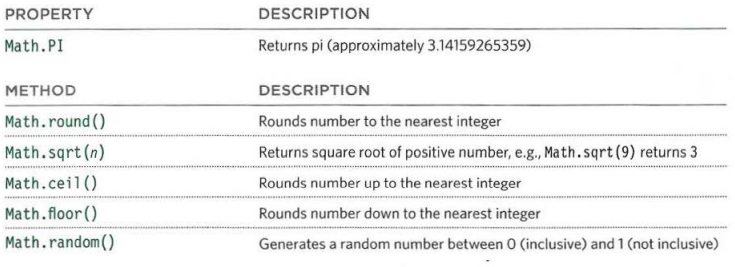
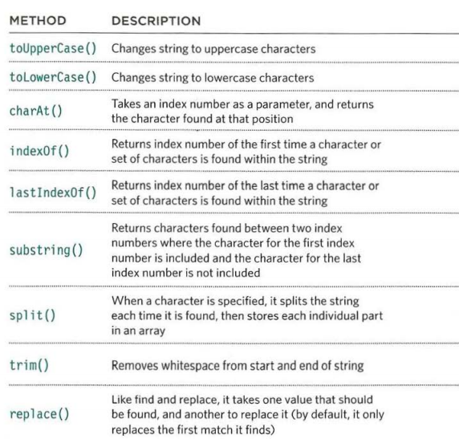
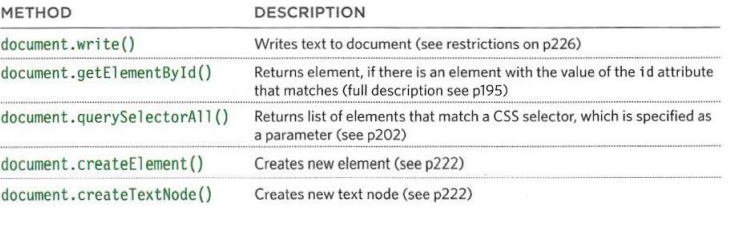

# HTML Tables; JS Constructor Functions
# Domain Modeling

+ **Domain modeling** is the process of creating a conceptual model in code for a specific problem. A model describes the various entities, their attributes and behaviors, as well as the constraints that govern the problem domain. An entity that stores data in properties and encapsulates behaviors in methods is commonly referred to as an object-oriented model.

+ A domain model that's articulated well can verify and validate the understanding of a specific problem among various stakeholders. As a communication tool, it defines a vocabulary that can be used within and between both technical and business teams.

## Generate random numbers

`Math.random();`

To model the random nature of user behavior, you'll need the help of a random number generator. 

### Here's some tips to follow when building your own domain models.

 1. When modeling a single entity that'll have many instances, build self-contained objects with the same attributes and behaviors.

 2. Model its attributes with a constructor function that defines and initializes properties.

 3. Model its behaviors with small methods that focus on doing one job well.

 4. Create instances using the new keyword followed by a call to a constructor function.

 5. Store the newly created object in a variable so you can access its properties and methods from outside.

 6. Use the this variable within methods so you can access the object's properties and methods from inside.

# HTML book

## Chapter 6: “Tables” 

`<table>`

  `<tr>`

   `<th>` Firstname`</th>`

  `</tr>`
  
  `<tr>`

 `<td>` Zienab`</td>`
    
  `</tr>`

`</table>`

+ A **table** represents information in a grid format. Examples of tables include financial reports, TV schedules, and sports results.

+ **HTML tables** allow web developers to arrange data into rows and columns.

+ The `<table>` tag defines an HTML table.

+ Each table row is defined with a `<tr>` tag.

+ Each table header is defined with a `<th>` tag. 

+ Each table data/cell is defined with a `<td> `tag.

+ long tables:
 1. `<thead>`

 2. `<tbody>`

 3. `<tfoot>`

# JS Book

## Chapter 3: “Functions, Methods, and Objects” 

## IN AN OBJECT:CONSTRUCTOR NOTATION 

`var person =new object();`

+ Web browsers implement objects that represent both the browser window and document loaded into browser window.

+ **Arrays** and **objects** can be used to create complex data sets(and both can contain the other).

+ the **new** ketword and the **object** constructor creat a blank object . you can then add **properties** and **methods** to the object .

## UPDATING AN OBJECT

  1. Ues dot notation:

    `person.name='zienab'; `

  2. Ues sequer brackets:

    ` person['name']='zienab';`

## THIS (IT IS A KEYWORD) 

+ The keyword this is commonly used inside functions and objects. Where the function is declared alters what this means. It always refers to one object, usually the object in which the function operates.

## Built-in object

1. DOCUMENT

2. HISTORY

3. LOCATION

4. NAVIGATOR

5. SCREEN

