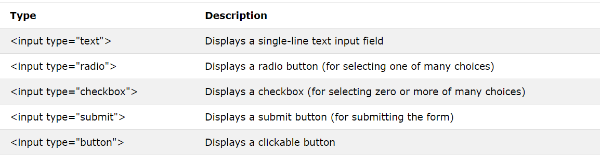

# Forms and JS Events

# HTML book

## Chapter 7: “Forms” 

### Forms

+ An HTML form is used to collect user input. The user input is most often sent to a server for processing(We can collect info from client by forms,by putting it inside form.).

+ The HTML `<input>` element is the most used form element.

+ An `<input>` element can be displayed in many ways, depending on the type attribute.

+ Each info in form had a name and value.

+ each form control is givin a name,and the text the user types in or the values of thre options they select are sent to the server

## Chapter 14: “Lists, Tables & Forms”

### Bullet point styles
       list-style-type

+ Unordered Lists

    `list-style-type:square;`

 1. none

 2. disc

 3. circle

 4. square

+ Ordered Lists

`list-style-type: lower-roman;`

 1. decimal

 2. decimal-leading-zero

 3. lower-alpha

 4. upper-alpha

 5. lower-roman

 6. upper-roman 

### Images for Bullets

`list-style-image: url(Src);`

### Positioning the Marker

`list-style-position: outside;`

1. outside

2. inside

# JS book

## Chapter 6: “Events”

+ HTML has the ability to let events trigger actions in a browser, like starting a JavaScript when a user clicks on an element.

### Event flow
+ HTMLelements nest inside other elements.if you hover or click on a link , you will be also hovering or clicking in its parent element .

+ The Flow of events only really matter when your code has event hanlers on an element and one of its ancestor or descendant elements .

### where events occur

+ the event object can tell you where the cursor was positioned when an event triggered.