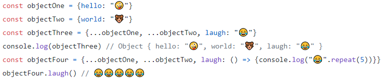

# Passing Functions as Props
## Lists and Keys
### Keys
Keys help React identify which items have changed, are added, or are removed.

### What does .map() return?
The **map()** function is used to iterate over an array and manipulate or change data items. In React, the **map()** function is most commonly used for rendering a list of data to the DOM.

+ JSX allows embedding any expression in curly braces so we could inline the **map()**

### Each list item needs a unique ____.

+ Keys used within arrays should be unique among their siblings. However they don't need to be globally unique

## How to Use the Spread Operator (…) in JavaScript

### What is the spread operator?
InJavaScript, spread syntax refers to the use of an ellipsis of three dots (…) to expand an iterable object into the list of arguments(The spread operator was added to JavaScript in ES6 (ES2015)).

### List 4 things that the spread operator can do.

1. Copying an array
2. Concatenating or combining arrays
3. Using Math functions
4. Using an array as arguments
5. Adding an item to a list
6. Adding to state in React
7. Combining objects
8. Converting NodeList to an array

### Give an example of using the spread operator to combine two arrays.

## React - How to Pass Functions between Components

Components are an integral part of React. Each React application consists of several components, and each component may require user interaction that triggers various actions.

### How can you pass a method from a parent component into a child component?
+ Passing method as a prop using the arrow function

